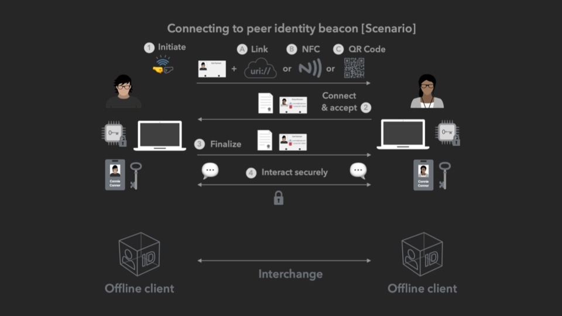
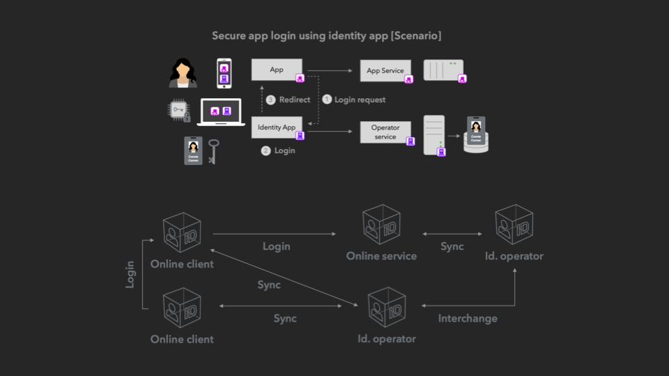
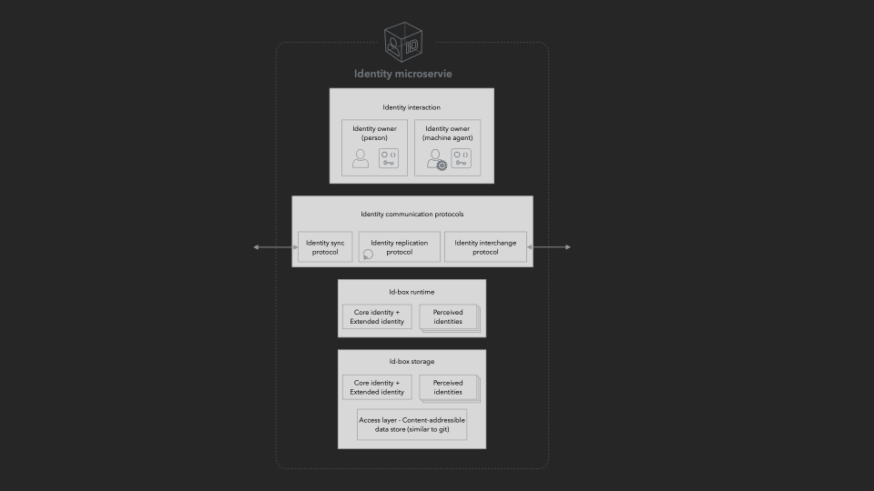

# 🏗 Implementation

Here we detail the implementation details at this Proof of Concept (PoC) stage. Definition and specification of PoC is primarily driven by the Universal Identity non-profit organization in order to shape an outline of an initial set of solutions, products, and protocols, as well as to prove out the technical feasibility of the greater Universal Identity vision. The details appearing here will be directly usable by all contributors including those from the non-profit organizations, community volunteers, project grantees, grant consortium members or supporters in other capacity.

The source code can be found here:


Universal Identity PoC project source code


## 🎯 Goals

* Mitigating technical risks of the Universal Identity system, specifically for its offline and online modes of operation which are more novel.
* Forcing function for initial and simplified definition of the Universal Identity protocol.
* A starting point for building Universal Identity ecosystem's seed components in form of Minimum Viable Products (MVPs)

## ⚡️ Technology stack

.NET Core 6 with C# and XAML was chosen for the implementation of this PoC, partly because of the initial founder's familiarity with and expertise in the platform, but also because of the technology's breadth of support for different platforms (macOS, Windows, etc) and modalities (client, server, etc.). Diversifying into other popular technology stacks is an upcoming priority.

## 📋 Project

The project will generally be executed in the following steps:

* Pass 1 - End-to-end components, no security - Getting all the components working end-to-end with minimal functionality
* Pass 2 - Full security -  Incorporating proper security including full cryptographic signing and verification of identities and communication at all stages.

## 🧩 Solutions

* 🕶 Offline - P2p identity
  * Consists of products: CLI program, UID library
* 📡 Online - Consumer identity
  * Consists of products: Identity app, Contacts app, UID library
* 🌍 (On-chain) Public identity
  * Consists of products: CLI program, Blockchain contracts, UID library

Corresponds 1-to-1 with Modes of operation:

* 🌍 On-chain - for Public entity identities
* 📡 Online - for Consumer identities
* 🕶 Offline - for Advanced identities

## 📦 Products

As part of seeding the ecosystem as well as to demonstrate the various end-to-end solutions, we will implement a minimal set of products:

* 💻 CLI program - Modes: Offline, on-chain
* 👥 Contacts app - Modes: Online
* 🆔 Identity app - Modes: Online
* 📚 UID library - Modes: Offline, online, on-chain
* ⛓ Blockchain contracts - Modes: on-chain

### 🧱 Components

The following software components will first be specified in detail and subsequently implemented  in order to construct the products above. all subpages of this topic correspond to first the solutions and then the software components being specified and implemented.

* **📚 UID library** - General purpose libraries, containing key UID functionality, for all layers of the stack, to be used in all modalities including on-device app and back end services.
  * **💾 Storage** - The layer responsible for storing identity box information, as well as performing signing and verification operations on individual information fragments. Each instance of a storage unit is logically referred to as an "id-box".
  * **🗄 Repository** - A sub-layer of storage, this sub-component is responsible for storage and access of tamper proof Content Addressable Storage (CAS) similar to Git, but with a few additional required features. Each repository instance is logically referred to as a "box"
  * **🏃Runtime** - The layer containing the in-memory object model that exposes higher level APIs for accessing and interacting with the stored identity box. The objects in this layer can be bound to XAML views as models, and these objects can also be accessed by communication protocols and other coordination mechanisms.
  * **🗣 Communication** - This layer is built on top of LibP2p and contains the sub-components for each protocol communication protocol including Sync, Interchange, Replication and Beacon.
  * **🤳 Interactive** - This layer deals with secure interactions with users as well as machine agents for the purposes of signing and securing interactions. It performs most if not all of the signing activity at the highest level.
  * **🎛  UI controls** (Out of scope) - Common XAML UI controls representing the different parts of an identity box as exposed to the user for interaction.
* **💻 CLI program** - Offline identity for peer-to-peer (p2p) operation.
* **🆔 Identity app** - Online identity synced and backed up by identity operator service and used to interact with other apps like Contacts app.
* **📇 Contacts app** - Online identity app showcasing login using identity app, as well as delegated permissions for managing contacts.
  * **Contacts app service** - Backing service for contacts app, which uses the same identity operator service in this specific prototype as its own backing identity service.
* **🆔Identity operator service** - Backing service for identity app, used to backup and sync identity information as well as used to interchange connection information with another operator instance or offline identity.

## 💪 Use cases

* 🔌 (Offline) P2p connection - Early adopter forms peer-to-peer offline connections with a fellow early adopter.
* // ✍️ (Offline) P2p signing and verification - Early adopter signs communication and data, then a fellow early adopter verifies them.
* ✋ (Online) App login - Consumer logs into apps using their internet identity app.
* // 👥 (Online) Contacts management - Consumer stores, accesses and manages their contacts using their internet identity and connections.
* // 📢 (On-chain) Public identity management - Public entity (persona, business, institution) creates and manages their public identity.
* // 💸 (On-chain) DeFi account management - Early adopter crypto user sets up and accesses their DeFi accounts on-chain.
* 🧑‍💻 App development - App developer can build a UID enabled application using .NET on any modality

### 🔌 (Offline) P2p connection

Implementing this use case requires the following components:

* UID library
* CLI client

Demo script:

```
idbox box create file://folder/idbox
idbox box open file://folder/idbox --interactive --start-service interconnect
>> ids list --summary
>> ids get-primary
>> id select 0xa1b2c3…d4e5f6
>> id get --summary
>> id-info set name --value some-name
>> connect beacon
[User2] >> connect respond http://192.168.0.15/beacon/j4k5l6l7o8
>> connection select 0xg7h8i9…j0k1l2
>> connection get --summary
>> connection-info get name
>> sign --input document.json --sigining signing.json
>> sign verify --inout document.json --signing signing.json
>> exit
```

Below diagram shows the interactions between two users and their P2P clients resulting in formation of an offline identity connection.



### ✋ (Online) App login&#x20;

Requires the following components:

* UID library
* Identity client
* Contacts app
* Identity operator service
* Contacts app service

Demo script:

1. Open identity-app and create identity box
2. Create a primary identity, as well as other contextual identities (friends/family, acquaintances, commerce, professional etc.)
3. Update identity information with name and image
4. Open some application, and login (connect) using the identity app
5. Perform high security actions from some app and be redirected to identity app
6. Open identity app, browse identities
7. Browse connections including some app
8. Re-open some application and perform in-app actions (no need to log in)
9. Log off, then log on again by being redirected to identity app

The diagram below shows the interaction between a user's online identity and the app they are trying to log into, along with the various distributed components involved.



### 🧑‍💻 App development

Across the various scenarios and architectures, the core of an identity component is responsible for keeping track of a user or agent's identity, as well as its connections. As such a common identity micro-service component will be used at each endpoint that will perform a number of common functions, and will have a number of common sub-components.



#### 📚 UID Library

The Universal Identity (UID) common library implements all common functionality to be used by all system components. It is fair to assume there will often be one implementation of UID library per common technology stack such as nodeJS, Java, .NET Core, Go, Rust, etc. In this PoC we start with .NET Core.
