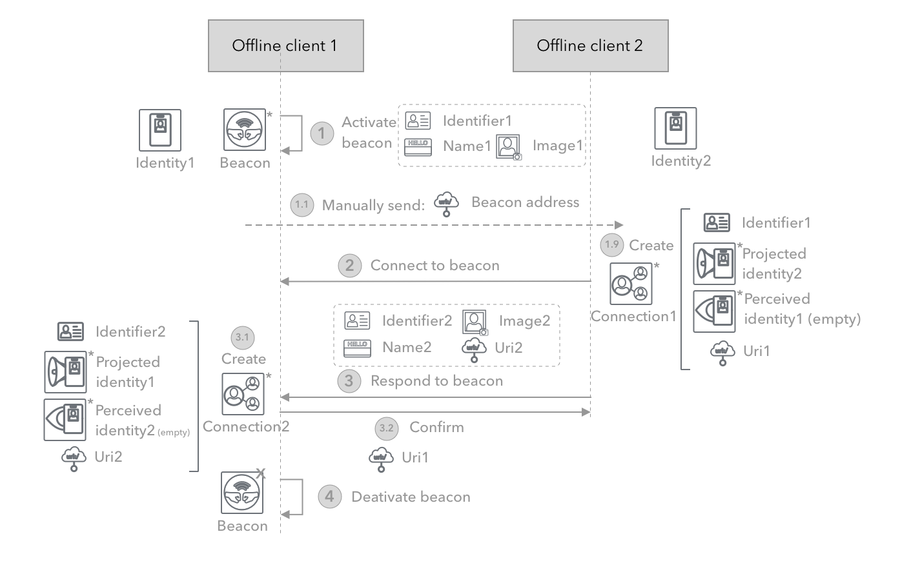
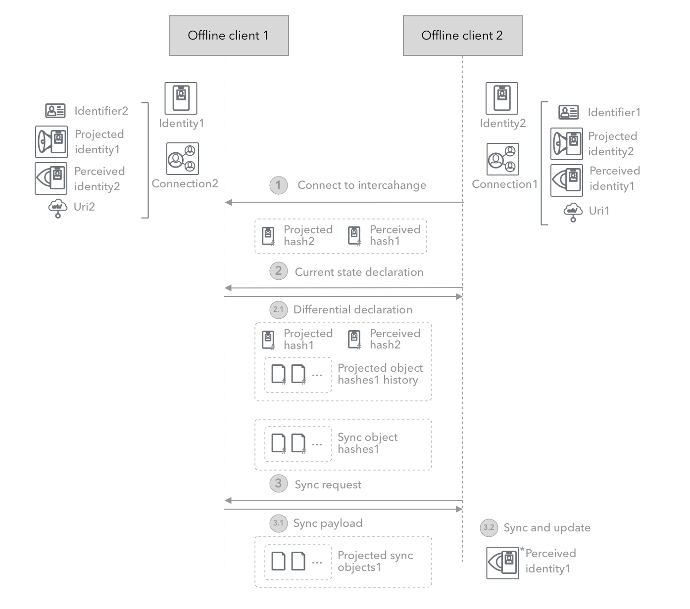

# 🗣 Communication

This layer contains the functionality for connecting and communicating between service instances of identity boxes. It uses LibP2p as its underlying networking and connectivity layer. Scenarios such as syncing across clients and identity operators, interchanging connection information across identities, replicating identities across operators, as well as connecting identities using the beacon protocol are the main uses of this layer.

## 🎬 Scenarios

* Developer programmatically starts a set of communication services.
* Developer programmatically activates a beacon and reacts to responses.
* Developer programmatically responds to beacon.
* Developer programmatically sets up IdBox service to sync from operator.
* Developer programmatically sets up IdBox connection to receive updates from source.

## 🎰 Functionality

### LibP2p configuration

LibP2p endpoints are configured through customizing the protocols available on a "Swarm" then starting the swarm and listening on a network interface address. Of course the LibP2p configuration will be slightly different depending on the various supported use-cases.

#### P2p offline use-cases

The LibP2p endpoints are initially expected to connect with each other on the same Local Area Network (LAN) although extensions for connecting through public addresses will be subsequently added. Here the "Swarm" will start listening on a local host, and may even announce its presence on that LAN in case of connection beacons using the beacon protocol.

Subsequently, there will be relaying public endpoints that can enable the Peer-to-peer (P2p) connections without the need for the clients being on the same LAN.

#### Online client use-cases

Given the focus here on consumer use cases, all connections and protocol interactions, will go through service backends, including identity interchange between identity operator services, sync between devices and app services, as well as connection initiations between users and/or apps.

On devices, the swarm instance will not listen locally, but will connect to the public endpoint provided for the various protocols including sync and beacon connection. On services such as the identity operator service, separate swarms per identity will listen in a public address for interactions including sync and interchange protocols.

### Protocols

As mentioned, with LibP2p various protocols can be defined and configured on each LibP2p endpoint. The following protocols are defined to accommodate the various communication needs of Universal Identity (UID) components.

#### Beacon protocol

The beacon protocol enables the very first connection between owners of identities, normally initiated by one of the parties. It relies on the initiating party listening on a shared medium such as a public endpoint, a LAN endpoint, or an NFC terminal, and communicating this fact and a media address with the responding party through an instant message, email, QR code, or NFC message.

After that point, both parties can connect using the UID beacon protocol and exchange specific identifiers for their owned identities. Of course there a few security considerations, such as progressive discovery of identity through maskings and transition, as well as requirement for a second verification factor upon connection to avoid spoofing attacks.



**P2p offline PoC implementation**

The initial implementation of the beacon protocol for the p2p offline Proof of Concept (PoC) will use basic LAN endpoints, LAN discovery with no additional security measures. The sequence of events is as follows:

1. First party initiates a beacon - This listens on a LAN address on any host, and sends a LAN discovery notification across the network.
2. The second party expresses interest - The second party's client notifies the user of a new beacon started on the LAN, and connects to receive basic contact information, such as just a first name and image.
3. Second party agrees to connect - Second party, after being given basic contact information, is asked to verify if they want to connect and agree to exchange contact information. Upon agreement extended identity information is sent to first party for connection.
4. First party confirms connection - First party sees full connection details and confirms the mutual forming of a connection. They also send extended identity information for a full connection.

#### Interchange protocol

The interchange protocol enable the full exchange of identity and connection information between two identities that have already formed a formal connection.

Aside from discovery and initial handshake, the interchange of identity information occurs more or less in the same manner for most classes of use-cases including offline and online ones.

The discovery and initial handshake work differently for online/connected use-cases and offline/p2p use cases. In the online/connected case, the identity box containing either of the identities is already well-known and reachable on a public endpoint address. In the offline case, a simpler configuration is where an offline endpoint is connecting to a public connected and online endpoint periodically to interchange information.

However the more complex case is when two offline endpoints are connecting. In this case, either we have to expect presence on a common and discoverable medium such as LAN, NFC, or QR code sequence, or at least one of the clients should be listening on a known public endpoints, when online.



**P2p offline PoC implementation**

The initial implementation of the interchange protocol for the p2p offline Proof of Concept (PoC) will use basic LAN endpoints, LAN discovery with no additional security measures. This allows for endpoints that already know each other to connect seamlessly and initiate interchange when both are present on LAN. This requires the storing of the endpoint address along with connection information. The sequence of events is as follows:

1. Prerequisite - Connection - First connection is made using the beacon protocol, the addresses for both LAN endpoints are stored as part of the connection information on both sides. One or both parties go offline, eventually one party comes back online.
2. Rediscovery and initialization - The second party comes online on the same LAN and is discovered and recognized by the other. It listens for interchange requests, and sends a connect request to the first party to initiate interchange within context of specific connections.
3. Interchanging metadata - The parties exchange sync information such as all the latest hashes on both sides and history of hashes.
4. Interchange sync - The parties sync data where each one is missing and verify
5. Propagation - The parties appropriately notify the users or other synced clients of these changes.

#### Sync protocol

The sync protocol enable the syncing of updated identity and connection information between devices as well as device and identity operator services. This is not implemented for the p2p offline PoC implementation, since there is only one device envisioned.

## 🗜 Interfaces

The communication service object will have the following interface:

```
public class CommunicationService
{
    public Swarm { get; set; }
    public void Start() {}
} 
```

The interfaces for the beacon protocol are:

```
public class BeaconProtocol : IPeerProtocol
{
    public string Name => "beacon";
    public SemVersion Version => "0.0";
    public BeaconMessage ProcessRequestCoreIdentity(Peer localPeer, BeaconMessage request, BeaconMessage response) {}
    public async Task<ConnectBeaconEndpoint> ConnectToBeacon(MultiAddress address) {}
}

[ProtoContract]
public class BeaconMessage
{
    [ProtoMember(1)]
    public BeaconMessageType Type { get; set; }
    [ProtoMember(2)]
    public BeaconConnectMessage BeaconConnectMessage { get; set; }
    [ProtoMember(3)]
    public BeaconRequestCoreIdentityMessage RequestCoreIdentityMessage { get; set; }
    [ProtoMember(4)]
    public BeaconPermitConnectionMessage PermitConnectionMessage { get; set; }
}

[ProtoContract]
public class BeaconConnectMessage
{
     [ProtoMember(1)]
    public ConnectBeaconState State { get; set; }
     [ProtoMember(2)]
    public string Identifier { get; set; }
     [ProtoMember(3)]
    public string Name { get; set; }
     [ProtoMember(4)]
    public string Image { get; set; }
}

[ProtoContract]
public class BeaconRequestCoreIdentityMessage
{
    [ProtoMember(1)]
    public string CoreIdentityJson { get; set; }
    [ProtoMember(2)]
    public string CoreIdentitySigning { get; set; }
    [ProtoMember(3)]
    public string CoreIdentitySigningHash { get; set; }
    [ProtoMember(4)]
    public string CoreIdentitySignature { get; set; }
}
```

The interfaces for the interchange protocol are:

```
public class InterchangeProtocol : IPeerProtocol
{
    public string Name => "interchange";
    public SemVersion Version => "0.0";
    public string GetLatest() {}
    public string[] GetRevisionHistory(string current) {}
    public RepositoryData GetSyncData(string sinceHash, string untilHash) {}
    
    // Incomplete ...
}
```

The interfaces for the sync protocol are:

```
public class SyncProtocol : IPeerProtocol
{
    public string Name => "sync";
    public SemVersion Version => "0.0";
    public string GetLatest() {}
    public string[] GetRevisionHistory(string current) {}
    public RepositoryData GetSyncData(string sinceHash, string untilHash) {}

    // Incomplete ...
}
```
