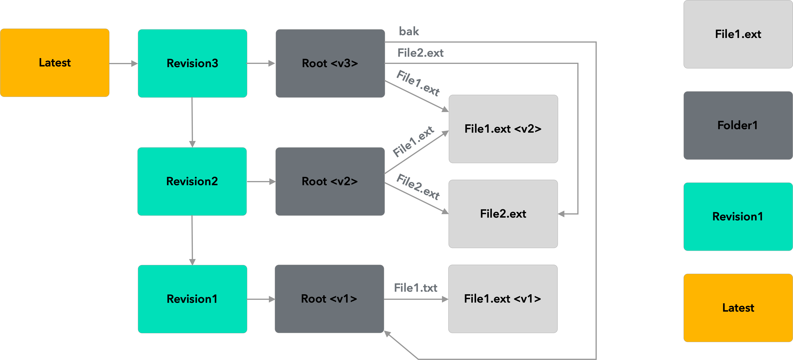
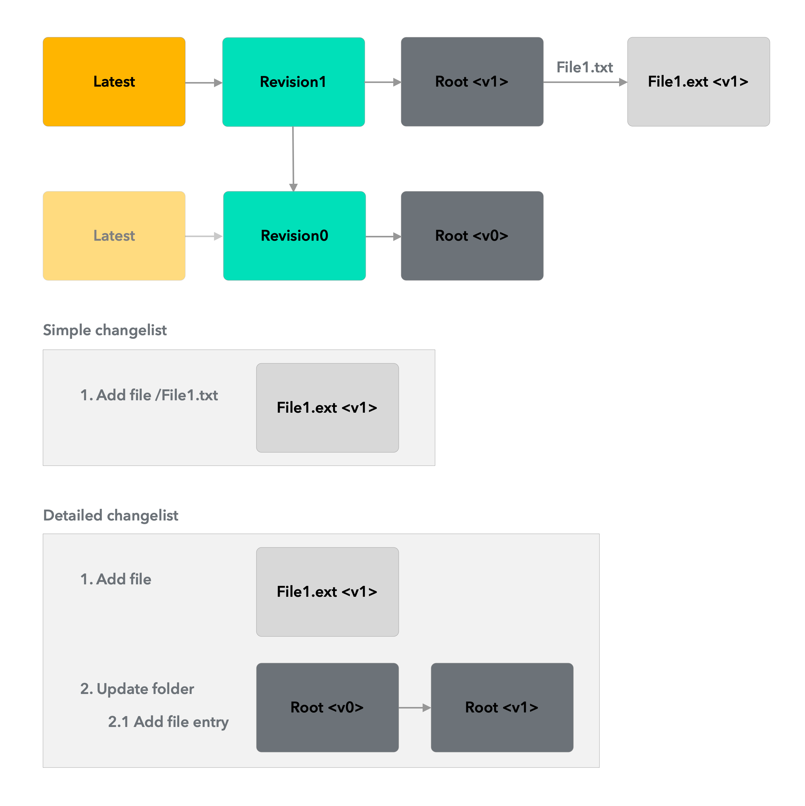
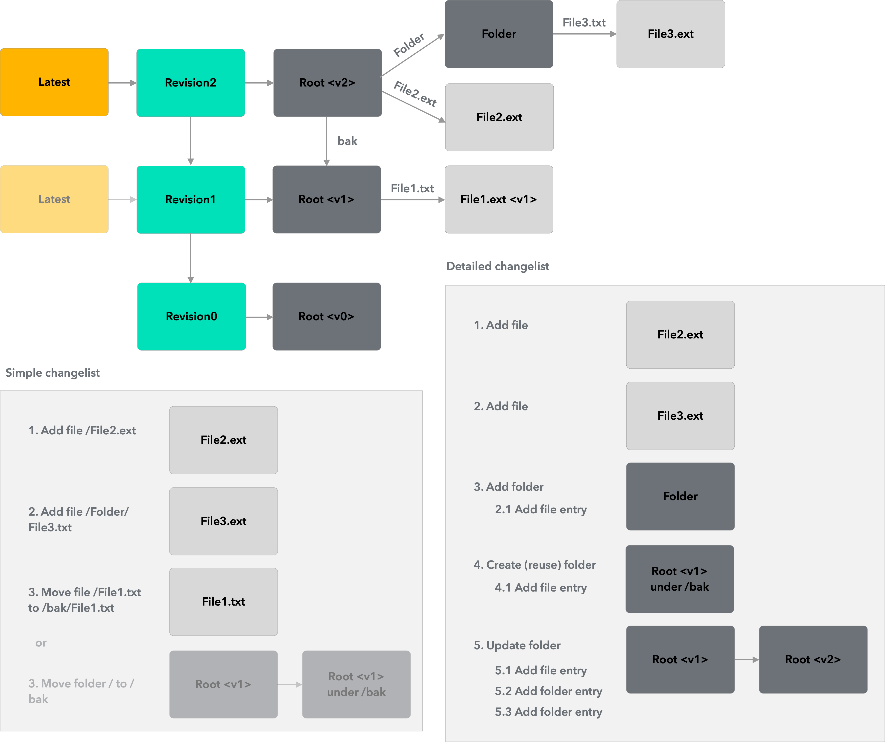

# Repository (box)

This sub-layer or sub-component of the UID library is responsible for abstracting operations against a tamper-proof Content Addressable Storage (CAS) system that offer a subset of the features from git as well as a few security focused features driven by requirements of universal identity.

## Concepts

A typical repository configuration contains historical data and looks something like the below:



### **Object types**

* Pointer
* Revision
* Folder
* File


### State

Initial state of the repository


State of the repository after a few changes: 1. file2.ext added 2. old folder added as "bak" folder

## Changes





## Modalities

The repository will be available for two modalities, namely under:

* Local file store - Cross platform
* Database - Likely NoSQL object-based such as MongoDB

## Interfaces

The repository object will have the following programming interfaces:

```
public class Repository
{
    public FileRepository(string path){}
    public void Init(){}
    public void ProcessChanges(IEnumerable<SimpleChange> changes) {}
    public string GetFileContents(string filePath, string fileName) {}
    UpdateOneFile(string basePath, string fileName, string fileContents) {}
    public void DeleteOneFile(string basePath, string fileName) {}
} 
    
public class SimpleChange
{
    public ObjectType ObjectType { get; set; }
    public ChangeType Type { get; set; }
    public string Path { get; set; }
    public string Contents { get; set; } // To add support for other file and later for any stream
}

public enum ObjectType
{
    Unspecified = 0,
    File,
    Folder,
    Iteration
}

public enum ChangeType 
{ 
    Unspecified = 0,
    Update, // Create or update
    Delete, 
    Rename // Only possible for folders
};
```

## Conventions

Convention for contents of a folder entry are as follows:

```
{type}-{hash}-{name}
```

A sample folder entry containing a file and a folder will look something like this:

```
folder-0x45dD963323A801333876785E20c7EF19FF120208-identities
file-0x99f1a6d12cb4b645dD963323A801333876785E20-id-box.json
```

## Functionality

The change processing logic is especially complex as it involves multiple steps in order to ensure the correct updating of the entire graph. The pseudo-algorithm for this process is as follows:

Prerequisite: All new and updated files with contents are added to repository with hashes. Subsequent passes are:

1. \[PASS1] Identify all change graph nodes, including affected folders, in a tree structure.
2. \[PASS2] Recursively work up from leaf files, and update parent folders
   1. Commit all parent folders after changes are finalized // (optional) \[under staging "/"]
3. &#x20;\[PASS3] Recursively work down the tree and make appropriate updates.
4.

## Similarities to Git

Git book: [https://git-scm.com/book/en/v2/Git-Internals-Git-Objects](https://git-scm.com/book/en/v2/Git-Internals-Git-Objects)

### Concepts&#x20;

* Objects
  * Tree = folder
  * Blob = file
* Commit = revision
* Head = latest
* Branch = line&#x20;

### Porcelain commands

```
Standard terminal command - not git: $ find .git/objects -type f
.git/objects/d6/70460b4b4aece5915caf5c68d12f560a9fe3e4
 
$ git hash-object -w test.txt
1f7a7a472abf3dd9643fd615f6da379c4acb3e3a
 
$ git cat-file -p d670460b4b4aece5915caf5c68d12f560a9fe3e4
test content
 
$ git cat-file -p master^{tree}
100644 blob a906cb2a4a904a152e80877d4088654daad0c859      README
100644 blob 8f94139338f9404f26296befa88755fc2598c289      Rakefile
040000 tree 99f1a6d12cb4b6f19c8655fca46c3ecf317074e0      lib
 
$ git cat-file -p 99f1a6d12cb4b6f19c8655fca46c3ecf317074e0
100644 blob 47c6340d6459e05787f644c2447d2595f5d3a54b      simplegit.rb
```

&#x20;


&#x20;

&#x20;
