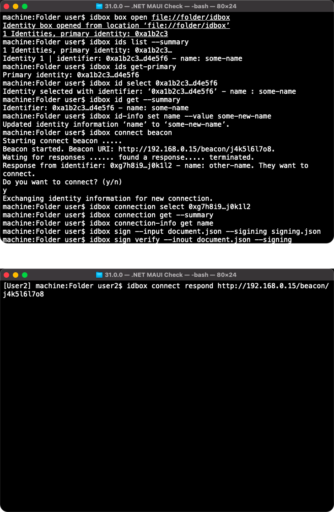

# CLI program

## Users

Early adopters and developers use the CLI client to manipulate their identity box using advanced commands and tools. They may even self-compile the application on their device platform before running it.

## Command Line Interface (CLI)

Given that the .NET Core team is using the following library for their internal and public projects, it makes sense to use the same library for our project:

[https://github.com/dotnet/command-line-api](https://github.com/dotnet/command-line-api)

## Modes of operation

* ~~Stateless commands - Out of scope for PoC~~
* Stateful commands - Commands run separately but with interconnecting state
* Interactive stateful commands - Commands run interactively with the user entering them

## State

The state will be stored under the folder that stateful commands were run. For example if one runs the command `idbox open c:\folder`  under `c:\` there will be a folder `c:\.idbox` created under which the state is saved. State is stored in a `state.json` and it looks like this:

```
{
    "path" : "c:\folder",
    "selectedIdentity" : "0xAB4245CD62348EF8237429347923469EFDACB3234",
    // "selectedConnection" : "0x9347923469EFDACB3234AB4245CD62348EF823742"
}
```

## Demo script

As mentioned in the PoC description, the following demo scripts cover the most visible features of the CLI client.

```
idbox box create file://folder/idbox
idbox box open file://folder/idbox --interactive
or
idbox interactive
>> ids list [--summary]
>> ids list --detail
>> ids get-primary
>> id select 0xa1b2c3…d4e5f6
>> id get --summary
>> id-info set name --value "John Smith"
// >> connect beacon
// [User2] >> connect respond http://192.168.0.15/beacon/j4k5l6l7o8
// >> connection select 0xg7h8i9…j0k1l2
// >> connection get --summary
// >> connection-info get name
// >> sign --input document.json --sigining signing.json
// >> sign verify --input document.json --signing signing.json
>> exit
```

## Experience



## Scenarios

* Early adopter creates a new identity box
* Early adopter opens an identity box in interactive mode
* Early adopter lists identities
* Early adopter accesses primary identity
* Early adopter accesses identity information
* // Early adopter initiates connection using a beacon
* // Early adopter responds to connection request on beacon
* // Early adopter accessed connection information
* // Early adopter signs outgoing files
* // Early adopter verifies signed incoming files

## Notes
