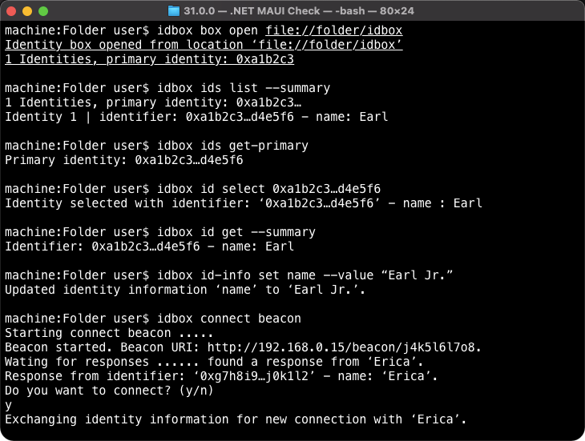
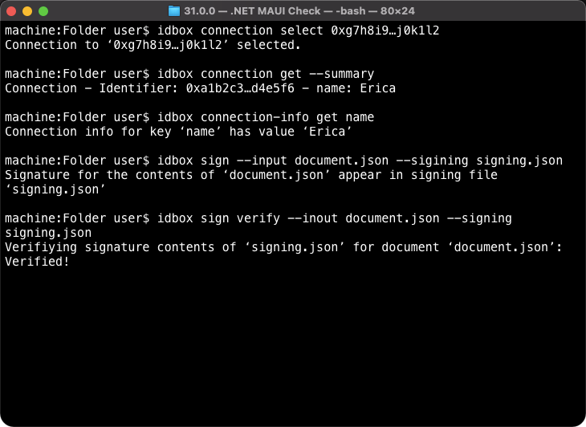

# 💻 CLI program

## 👩🏻 Users

Early adopters and developers use the CLI client to manipulate their identity box using advanced commands and tools. They may even self-compile the application on their device platform before running it.


Early adopter persona under Personas page of the Industry map&#x20;


## 🎬 Scenarios

* Early adopter creates a new identity box
* Early adopter opens an identity box in interactive mode
* Early adopter lists identities
* Early adopter accesses primary identity
* Early adopter accesses identity information
* // Early adopter initiates connection using a beacon
* // Early adopter responds to connection request on beacon
* // Early adopter accessed connection information
* // Early adopter signs outgoing files
* // Early adopter verifies signed incoming files

## 🎰 Functionality

### Modes of operation

* Stateless commands - Isolated Command that have all required parameters passed in.
* Stateful commands - Commands run separately but with parameters set by previous commands.
* Interactive (stateful) commands - Commands run interactively as the user inputs them.

#### Interactive commands

Commands run interactively as the user inputs them, while other inputs and outputs are also available to the user. See example sample below where `>>` appears before interactive  commands and `<<` before input prompts:

```
idbox interactive
>> box open file://folder/idbox
>> ids list
>> ids get-primary
<< do you want to connect to 'Akon'? (y/n)
<< _ 
```

### State

The state will be stored under the folder that stateful commands were run. For example if one runs the command `idbox open c:\folder` under `c:\` there will be a folder `c:\.idbox` created under which the state is saved. State is stored in a `state.json` and it looks like this:

```
{
    "path" : "c:\folder",
    "selectedIdentity" : "0xAB4245CD62348EF8237429347923469EFDACB3234",
    // "selectedConnection" : "0x9347923469EFDACB3234AB4245CD62348EF823742"
}
```

### Dependencies

Given that the .NET Core team is using the following library for their internal and public projects, it makes sense to use the same library for our project:


Command Line Interface API used by the .NET Core team


## 🎭 Demo script

As mentioned in the PoC description, the following demo scripts cover the most visible features of the CLI client.

```
idbox box create file://folder/idbox
idbox box open file://folder/idbox
idbox interactive
>> ids list [--summary]
>> ids list --detail
>> ids get-primary
>> id select 0xa1b2c3…d4e5f6
>> id get [--summary]
>> id-info set name --value "John Smith"
// >> connect beacon
// [User2] >> connect respond http://192.168.0.15/beacon/j4k5l6l7o8
// >> connection select 0xg7h8i9…j0k1l2
// >> connection get [--summary]
// >> connection-info get name
// >> sign --input document.json --sigining signing.json
// >> sign verify --input document.json --signing signing.json
>> exit
```

## 📺 Experience





## Notes
