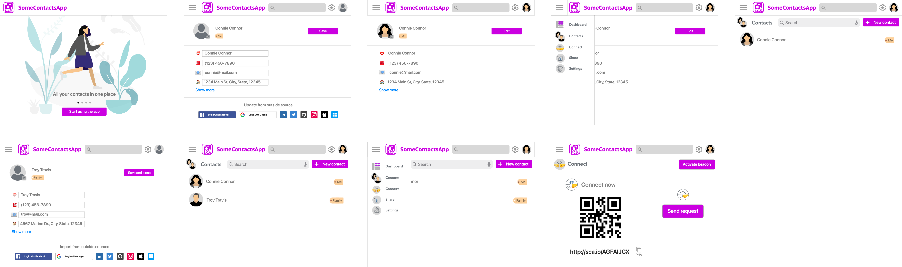

# 📇 Contacts app

Online identity app showcasing login using identity app, as well as delegated permissions for managing contacts.

## 👩🏻 Users

The component is used by consumers to manage their identities. These identities are stored and maintained as part of the identity box construct defined in Universal Identity. It is backed up and synced on the user's identity operator service.


Consumer persona under Personas page of the Industry map


## 🎬 Scenarios

* Consumer logs into the contacts app for the first time
* Consumer updates self contact information
* Consumer adds, updates or deletes contact information
* Consumer connects to a new contact after activating a beacon&#x20;

## 🎰 Functionality

* Quick login
* Login using identity app
* Contacts access (create, update, delete)
* Beacon and connection formation
* Identity change propagation to online connections
* // Contact sharing

## 📺 Experiences

The experiences available as part of the proof of concept (PoC) are a subset of one would envision as part of the final contacts app. Below you can see a demo script experience for the final contacts app.

### Demo script

1. Consumer opens the contacts app for the first time (quick-login)
2. Consumer performs a quick login (create a new IdBox and identity)
3. Consumer sets your user information manually
4. Consumer adds a contact manually
5. Consumer starts a beacon and makes a new connection
6. // Consumer shares a contact using a link

#### User interface

