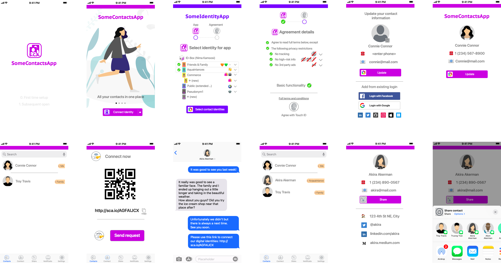

# 📇 Contacts app

Online identity app showcasing login using identity app, as well as delegated permissions for managing contacts.

## 👩🏻 Users

The component is used by consumers to manage their identities. These identities are stored and maintained as part of the identity box construct defined in Universal Identity. It is backed up and synced on the user's identity operator service.


Consumer persona under Personas page of the Industry map


## 🎬 Scenarios

* Consumer logs into the contacts app for the first time
* Consumer updates self contact information
* Consumer connects to a new contact after activating a beacon&#x20;

## 🎰 Functionality

## 📺 Experiences

The experiences available as part of the proof of concept (PoC) are a subset of one would envision as part of the final contacts app. Below you can see a demo script experience for the final contacts app.

