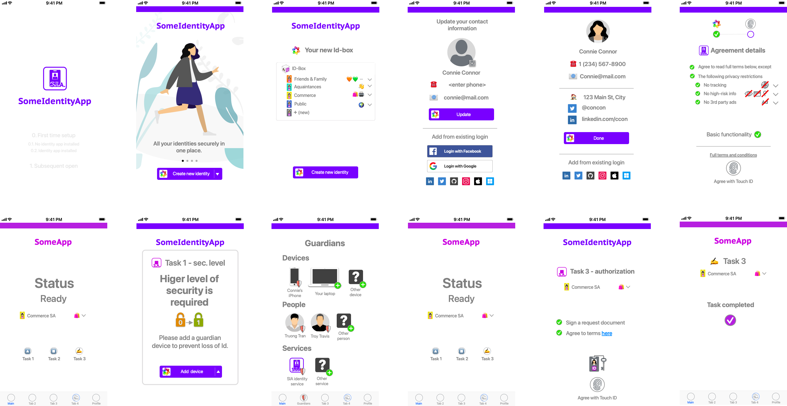

# 🆔 Identity app

Online identity synced and backed up by identity operator service and used to interact with other apps like Contacts app.

## 👩🏻 Users

The component is used by consumers to manage their identities. These identities are stored and maintained as part of the identity box construct defined in Universal Identity. It is backed up and synced on the user's identity operator service.


Consumer persona under Personas page of the Industry map


## 🎬 Scenarios

* Consumer creates an IdBox with a standard set of seed identities
* Consumer updates identity information
* Consumer uses the security app to log into a vertical app

## 🎰 Functionality

* IdBox and identity set up
* App login
  * Code-based app interaction
    * Online - Public URI-based code exchange
    * // Offline - Full code exchange
  * // Desktop app redirect
  * // Mobile app redirect
* Crypto transaction signature
* // Privacy preferences

## 📺 Experiences

The experiences available as part of the proof of concept (PoC) are a subset of one would envision as part of the final identity app. Below you can see a demo script experience for the final identity app.

