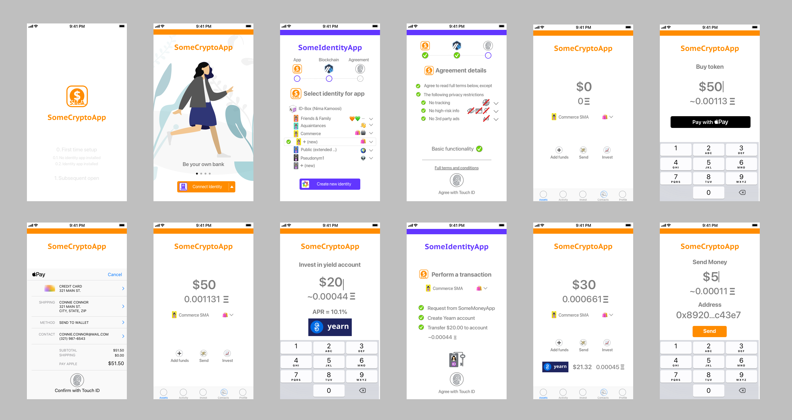
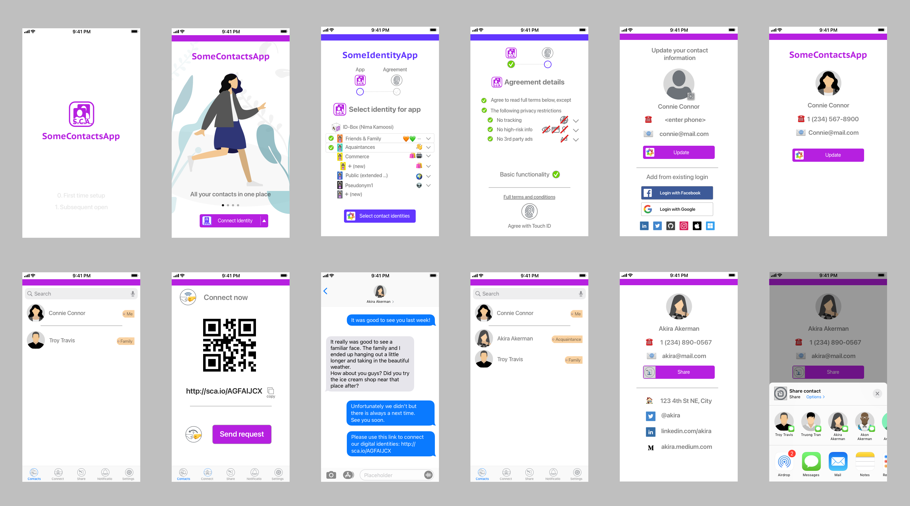
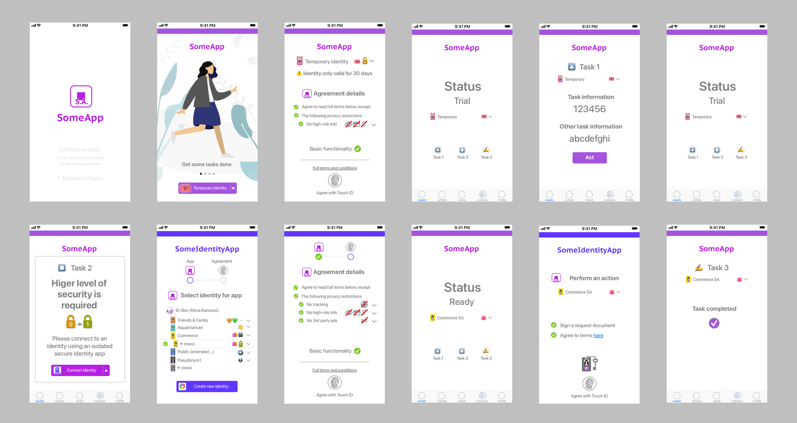
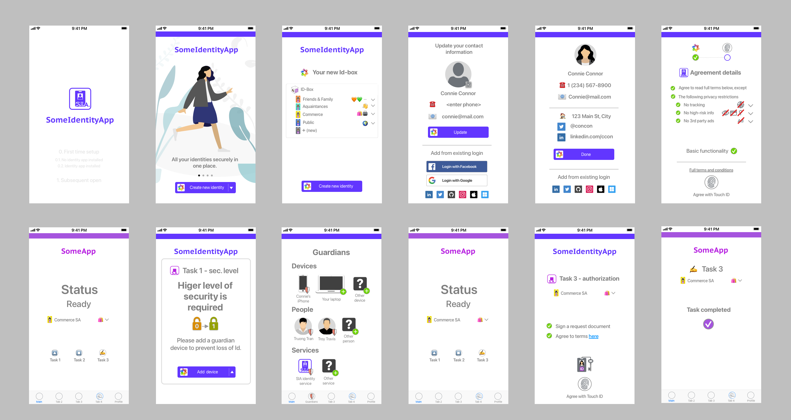

# 📖 Stories

Stories, aka **demo scripts**, are simplified end-to-end scenarios demonstrating a user's experience from start to end of well-known tasks, within a well known context. It is usually targeted to a specific sub-audience with a particular perspective and points of reference. Demo scripts provide an effective medium for communicating the end-to-end set of steps and usage details that products and solutions can offer.

## 👩🏻 Consumer journey

Is the most common and likely scenario for a consumer over many months, told from the perspective of that user.

The story is of a user who discovers and downloads an identity for the first time, in order to set up their identity box. The user then uses this identity box inside a contacts app to setup their own contact and add a few friends, family and acquaintances as contacts. The user then uses the same identity box and app to login to apps.

Experience:

Dimensions used:

* 🧬 App types: Native apps on iOS
* 📲 App-to-app interaction: Identity app redirect and back, online web connection through QR
* 📱 Identity app: Existing online app - ⚙️ Operation: Online operator
* 🙍 Identity: Newly created and existing
* 🛡 Guardianship: None
* 🔐 Security level: 2 (order of $10K)
* 👤 Identity type: Social circles, commercial
* 👥 Multi-identity: Different identities for contacts and login

Steps:

1. Identity app install and opening
   1. User navigates to a specific identity app
   2. User downloads the app to device
   3. User opens the app
2. App set up
   1. App initiates identity set up
   2. User select the default set up for a new identity box (with circles for friends & family, acquaintances, commerce identities, and public identities)
   3. User enters their core identity information (name, phone, email, address, Twitter, Facebook, LinkedIn, etc.)
3. Contacts app install and opening
   1. User navigates to a specific contacts app
   2. User downloads the app to device
   3. User opens the app
4. Contants app set up and redirect
   1. User selects default preferences to use existing identity app
   2. User is redirceted to identity app
   3. User selects identity box and identities
   4. User agrees with contact app's terms of use
   5. User is redirected to the contacts app with all contacts available
5. Connecting with existing contact
   1. User initiates a open connection
   2. User sends someone they know a link to their open connection
   3. The other user confirms connection and this user accepts.
   4. User is redirected to and can see new connection
6. Discovery, install and opening
   1. User discover an identity app online
   2. User clicks App Store icon to download
   3. User downloads the app to device
   4. User opens the app
7. Vertical app set up - existing identity 2. User chooses to connect to existing identity app on device and is redirected 3. User selects a new commerce identity 4. User completes agreements including privacy preferences 5. Identity app redirects back to the app 6. User is shown that the vertical app is ready
8. Vertical app usage
   1. ...

## 💸 Crypto app

Is the most simplified and likely scenario of using a mobile money app, told from the perspective of those versed in money and cryptocurrency. As part of the Web 3.0 wave, we are making an assumption here, that money tasks can be performed directly on a public blockchain after creating an account in form of a smart contract, and utilizing the cryptographic private keys securely stored on devices as part of an identity app.

This generally tells the story of a user who discovers a public blockchain money app for the first time, downloads and installs it, links it up with UID (Universal Identity) using an identity app, creates a blockchain account, and then uses it by first loading money into the account, then investing some of that money in a yield producing savings account, and then by sending an amount to a contact.

Experience:

Dimensions used:

* 🧬 App type: Native app on iOS
* 📲 App-to-app interaction: Identity app redirect and back
* 📱 Identity app: Existing online app - ⚙️ Operation: Online operator
* 🙍 Identity: Newly created
* 🛡 Guardianship: None
* 🔐 Security level: 2 (order of $10K)
* 👤 Identity type: Pseudonymous
* 👥 Multi-identity: Same identity used for app connection and blockchain account
* ⛓ Public blockchain: Ethereum L2 (Arbitrum)

Steps:

1. Discovery, install and opening
   1. User discover a crypto (blockchain assets) app online
   2. User clicks App Store icon to download
   3. User downloads the app to device
   4. User opens the app
2. App set up
   1. User selects set up preferences, or skips opting to use defaults
      1. Defaults: Existing native identity app
   2. Initiate identity set up
3. Identity app redirect
   1. User selects a new transactional identity that connects to money app
   2. User confirms same identity is used for public blockchain account
   3. User confirms privacy preferences and agrees to terms with privacy exceptions
   4. Identity app redirects back to money app
4. Blockchain account set up
   1. The money app sets up an account on the blockchain
   2. User can see the account with starting balance(s)
5. Loading up money
   1. User clicks on add money
   2. User types in amount and confirms fees
   3. User selects Apple Pay as method of payment and confirms payment
   4. Money is loaded up on the blockchain account and balance is updated
6. Investing and receiving yield
   1. User clicks on invest
   2. User selects a yield producing investment vehicle
   3. User selects amount and confirms
   4. User is redirected to identity app
   5. User confirms blockchain transaction and signs it
   6. User is redirected back to money app
   7. The transaction completes and balance is updated, as well as list of investments
7. Sending an amount
   1. User looks up a crypto account number on a website
   2. User goes to money app and clicks on send money
   3. User enters the account number
   4. User enters the amount to send and confirms fees
   5. User completes the send operation, app is authorized to send the amount directly
   6. The user balance is updated, as well as list of transactions

Dimensions possible:

* 🧬 App type: Web app, Native app on Android
* 📲 App-to-app interaction: None (temporary identity used), web identity app redirect, online web connection through QR, offline QR interaction
* 📱 Identity app: Existing offline app, new app download/setup, web app
* 🙍 Identity: Existing identity
* 🛡 Guardianship: Identity provider, social, or combination
* ⚙️ Operation: Offline operation
* 🔐 Security: 1 (order of $100), 3 (order of $1M)
* 👤 Identity type: Public, transactional, etc
* 👥 Multi-identity: Different identities used for app connection and blockchain account
* ⛓ Public blockchain: Bitcoin, Ethereum, Ethereum L2 (Arbitrum, Optimism)

## 📇 Contacts app

Is the most simplified and likely scenario of using a mobile contacts app, told from the perspective of regular consumers.

This generally tells the story of a consumer who discovers a contacts app for the first time, downloads and installs it, sets up identity by connecting to an ID app with existing identity, confirms their contact info, connects with another person through setting up a beacon and sharing its QR code, then searches for the new contacts in their contact list confirming its details including address and public identity, then shares that contact with another person through a messaging app.

Experience:

Dimensions used:

* 🧬 App type: Native app on iOS
* 📲 App-to-app interaction: Identity app redirect and back
* 📱 Identity app: Existing online app - ⚙️ Operation: Online operator
* 🙍 Identity: Existing social identity
* 🛡 Guardianship: None
* 🔐 Security level: 2 (order of $10K)
* 👤 Identity type: Acquaintance
* 📡 Device-to-device communication: QR code, URI link

Steps:

1. Discovery, install and opening
   1. User discover a contacts app online
   2. User clicks App Store icon to download
   3. User downloads the app to device
   4. User opens the app
2. App set up
   1. User selects set up preferences: Existing native identity app
   2. Initiate identity set up
3. Identity app redirect
   1. User selects a friends and family social circle identity that connects to contacts app
   2. User confirms privacy preferences and agrees to terms with privacy exceptions
   3. Identity app redirects back to contacts app
4. Contact set up
   1. The contacts app asks for additional contact information such as profile picture
   2. User points the app to existing social profiles including Instagram or Facebook
   3. User can see the updated contact profile information
5. Connecting with existing contact
   1. User initiates a connection beacon
   2. User sends someone they know a link to their connection beacon
   3. The other user confirms connection and this user accepts.
   4. User is redirected to and can see new connection
6. Receiving a connection request from existing contact
   1. User receives a connection beacon link from another friend
   2. User accepts the connection
   3. The other user accepts and the connection is created and updated
7. Connecting to new person
   1. User initiates a new connection beacon
   2. User allows the other person to scan their QR code
   3. The connection is accepted and created
   4. User is redirected to and can see the contact information
8. Browsing, searching and sharing contacts
   1. User searches for a known contacts name
   2. User selects the contact and looks at details
   3. User shares the contact with an existing contact by sending them a file as IM message

## 🕶 Privacy

* Setting commercial connection defaults
* Setting contacts defaults - Friends and family, acquaintances
  * Example: Acquaintances: Freely share contact with others - Friends & family: Share contact with permission - Do not store home address, always ask, automated permission - Commercial, forget my identity and related information
* New commercial connection
  * Agreeing to terms with privacy exceptions
  * Immediate feedback about limited (or no) functionality
  * Minimal adjustment made, functionality level updated
  * Finalize agreement and redirect back to app
* Last chance for app to respond to selection

Is the most simplified and likely scenario of using a mobile identity app to set up and use privacy preferences, told from the perspective of a regular consumer. Here we are making an assumption that apps will offer a standard-based app data privacy label, as well as a digitally signable usage terms agreement, which will allow consumers to express their privacy preferences as part of connecting to apps.

This generally tells the story of a consumer who first sets up their privacy preferences through an identity app. The consumer then discovers a smartphone app for the first time, downloads and installs it, links it up with UID (Universal Identity) using an identity app using their default privacy preferences, resolves any conflicts between their preference and the app's data collection requirements, and completes agreeing to the app's usage terms pending their updated preferences, then uses the app normally.

It could also contain the story of a consumer who sets up different preferences for their social circles, and watches them take effect. Also the consumer can try to look up a contact's privacy preferences as they connect. Things like sharing the contact with others, always having to ask for address, and auto permitting. Things like right to forget me from an ex romantic partner.

Dimensions used:

* 🧬 App type: Native app on iOS
* 📲 App-to-app interaction: Identity app redirect and back
* 📱 Identity app: Existing online app - ⚙️ Operation: Online operator
* 🙍 Identity: Existing identity
* 🔐 Security level: 2 (order of $10K)
* 👤 Identity type: acquaintances, friends & family
* 👥 Multi-identity: Identities for acquaintance circle and friends and family circle

Steps:

1. Setting up privacy preferences
   1. User opens their existing identity app
   2. User goes to privacy preferences section
   3. User goes to commercial privacy settings
   4. User sets up new commercial connections to use masked identities, with name only (and email aliases from list)
   5. User sets up privacy agreement preferences to default (no tracking, no advertising, no sensitive data collection, etc)
   6. User goes to the identities section
   7. User confirms friends and family identity is isolated from acquaintances but not the other way
2. New ad-supported free app discovery, install and opening
   1. User discover a new ad-supported free app online
   2. User clicks App Store icon to download
   3. User downloads the app to device
   4. User opens the app
3. App set up
   1. User selects set up preferences (or skips opting) to use defaults
      1. Defaults: Existing native identity app
   2. Initiate identity set up
4. Identity app redirect
   1. User is automatically asked to confirm a new masked commercial identity, with name only
   2. User sees that privacy preferences are in conflict, and that based on current settings, especially no advertising exception, app will not function.
   3. User views the conflict, it has a message and image from the new app explaining why "no advertising" exception is incompatible
   4. User agrees to remove "no advertising" exception, and conflict is resolved
   5. User agrees to terms with other privacy exceptions
   6. Identity app redirects back to contacts app
5. App usage after setup complete
   1. Back at the app and it is set up
   2. User confirms being logged in under their new commercial Id
   3. User performs action that requires more user information, such as address
   4. User confirms the action and is redirected to identity app
6. Upgrading data access on identity app
   1. User confirms and agrees to additional data (phone number) shared with app
      1. One option, not selected, is to transition to the main commercial id account.
   2. User is redirected to app
7. App usage after privacy change
   1. Back at the app and it is set up
   2. User confirms being logged in under their new commercial Id with phone number

## ⏹ App login

Is the most simplified and likely scenario of using any vertical app, told from the perspective of regular consumers.

This generally tells the story of a consumer who discovers a vertical app (eg AirBnB, Target, Lyft, etc.) for the first time, downloads and installs it, uses a temporary identity to perform some tasks in trial mode, then in order to perform more secure tasks, sets up identity by connecting to an ID app with a new commerce identity, and completes the action, then moves on to more advanced actions like ones that require a signature or direct authorization, which ends up using the identity app.

Experience:

Dimensions used:

* 🧬 App type: Native app on iOS
* 📲 App-to-app interaction: Identity app redirect and back
* 📱 Identity app: Existing online app - ⚙️ Operation: Online operator
* 🙍 Identity: Existing social identity
* 🛡 Guardianship: None
* 🔐 Security level: 2 (order of $10K)
* 👤 Identity type: Acquaintance
* 📡 Device-to-device communication: QR code, URI link

Steps:

1. Discovery, install and opening
   1. User discover an identity app online
   2. User clicks App Store icon to download
   3. User downloads the app to device
   4. User opens the app
2. App set up - temporary embedded identity
   1. User selects set up preferences (or skips opting) to use defaults
      1. Defaults: Existing native identity app
   2. Initiate temporary identity set up
   3. User completes app agreement
   4. App is now in trial mode
3. First task- low security
   1. User performs and completes a task
   2. Note: No need to login in a separate app
4. Second task - medium security
   1. User initiates task and is reminded they need to connect to identity app
   2. User initiates connecting to existing identity app on device and is redirected
   3. User selects a new commerce identity
   4. User completes agreements including privacy preferences
   5. Identity app redirects back to the app
   6. Task is completed
5. Third task - direct authorization needed
   1. User initiates task and is reminded they need to connect to identity app
   2. User is redirected to identity app to authorize action
   3. User authorizes action
   4. User is redirected back to app
   5. Task is completed

## 🆔 ID app

* Setting up identity box using the ID app
* Using ID app as 2nd factor for higher security operation
* Using ID app to set up second device ID app
* Using ID app to set up a guardian contact
* Using ID app tp setup identity operator service as guardian
* ID native app \[Identity perspective] - Using one's identity to sign data such as an agreement

Dimensions used:

* 🧬 App type: Native app on iOS
* 📲 App-to-app interaction: Identity app redirect and back
* 📱 Identity app: Existing online app - ⚙️ Operation: Online operator
* 🙍 Identity: Existing social identity
* 🛡 Guardianship: None
* 🔐 Security level: 2 (order of $10K)
* 👤 Identity type: Acquaintance
* 📡 Device-to-device communication: QR code, URI link

Experience:

Steps:

1. Discovery, install and opening
   1. User discover an identity app online
   2. User clicks App Store icon to download
   3. User downloads the app to device
   4. User opens the app
2. App set up
   1. User selects set up preferences (or skips opting) to use defaults
      1. Defaults: Existing native identity app
   2. Initiate identity set up
3. Identity app redirect
   1. User selects a friends and family social circle identity that connects to contacts app
   2. User confirms privacy preferences and agrees to terms with privacy exceptions
   3. Identity app redirects back to contacts app
4. Contact set up
   1. The contacts app asks for additional contact information such as profile picture
   2. User points the app to existing social profiles including Instagram or Facebook
   3. User can see the updated contact profile information
5. Connecting with existing contact
   1. User initiates a connection beacon
   2. User sends someone they know a link to their connection beacon
   3. The other user confirms connection and this user accepts.
   4. User is redirected to and can see new connection
6. Receiving a connection request from existing contact
   1. User receives a connection beacon link from another friend
   2. User accepts the connection
   3. The other user accepts and the connection is created and updated
7. Connecting to new person
   1. User initiates a new connection beacon
   2. User allows the other person to scan their QR code
   3. The connection is accepted and created
   4. User is redirected to and can see the contact information
8. Browsing, searching and sharing contacts
   1. User searches for a known contacts name
   2. User selects the contact and looks at details
   3. User shares the contact with an existing contact by sending them a file as IM message

## ↘️ Other stories

Other stories (demo scripts) include:

* ⚙️ Online operation
* 🌐 Web 2.0 transition
  * Web 2.0 native app login \[Web 2.0 perspective] - ID app redirect, new identity, existing operator and app, bootstrap from UID core identity, operator guardianship
    * Web login
    * Temporary login - no ID app
    * Existing identity
    * New operator/app download and setup
    * Offline - no operator (self-operated) - manual self-guardianship using second device
    * Bootstrap from Web 2.0 Id. Provider - eg. Google, Facebook
    * Social guardianship, or combination
* 🔌 Offline
* 🌍 Public
* 🩹 Recovery
  * Guardianship and recovery \[Recovery perspective]
* 👥 Multi-identity
  * focus on difference in expression per identity Some focus on anonymous and pseudonymous identities
* 🧑‍💼 ID management
  * ID web app, Identity organization, search and maintenance \[management perspective] -
* ☑️ Consumer choice
  * ID operator and app switch \[Consumer choice perspective] -
* 🏁 Onboarding
  * First time app and operator setup \[Onboarding perspective] - as part of new app signup
    * One off - not as part of other app signup
* 🗂 Data app (Files)
* 💻 Web apps
* 🧰 Breadth
  * Online ID-box for use with friends, family, acquaintances, and the public
  * Public pseudonymous blockchain identity for use with crypto tokens and NFTs
  * Pseudonymous or minimally identified online identities used for aliases, one-off private tasks and purchases
  * Private offline identities for sensitive tasks
  * Public official identity with social media and public blockchain presence
